# Rimus0cod

### Machine Learning · AI · Systems · Linux

 

---

## 🧠 About

I'm a developer focused on **Machine Learning, AI, neural networks and systems**.

I enjoy building things from scratch, running controlled experiments, measuring results, and using the evidence to decide what to change next.

### Areas I work with

- 🧠 Neural network architectures
- 🎯 Reinforcement learning
- 🧬 Biologically-inspired computation
- 🔬 Experiments, diagnostics and baselines
- 🐍 Python + PyTorch
- 🐧 Linux systems

---

## ⚙️ Tech Stack

### Languages

### ML / Data

 

### Systems & Tools

---

## 📊 GitHub

---

## 🚀 Selected Projects

<table>
<tr>
<td width="50%" valign="top">

### 🪰 FlyBrain

Experimental research into **biologically-inspired neural architectures, recurrent dynamics and learned behavior**.

</td>
<td width="50%" valign="top">

### ⚖️ AI_balancer

An experimental project focused on **AI-driven balancing and control**.

</td>
</tr>
<tr>
<td width="50%" valign="top">

### 🤖 control

A practical Python project for **automation, control and service-style workflows**.

</td>

</tr>
</table>

> These projects cover different parts of my work — from ML research and experiments to practical software and tooling.

---

## 🔬 Current Focus

| Area | Focus |
|:---:|:---|
| 🧠 | Neural architectures |
| 🎯 | Reinforcement learning |
| 🧬 | Biologically-inspired AI |
| 🔄 | Recurrent dynamics |
| 🧪 | Experimental methodology |
| 📊 | Diagnostics & baselines |
| 🐧 | Linux & systems |

---

## 🐍 Contribution Activity

  <picture>
    <source media="(prefers-color-scheme: dark)" srcset="https://raw.githubusercontent.com/Rimus0cod/Rimus0cod/output/github-contribution-grid-snake-dark.svg">
    <source media="(prefers-color-scheme: light)" srcset="https://raw.githubusercontent.com/Rimus0cod/Rimus0cod/output/github-contribution-grid-snake.svg">
    
  </picture>

---

## 🧩 Philosophy

**Build → Measure → Diagnose → Experiment → Repeat**

### Building. Experimenting. Learning.

